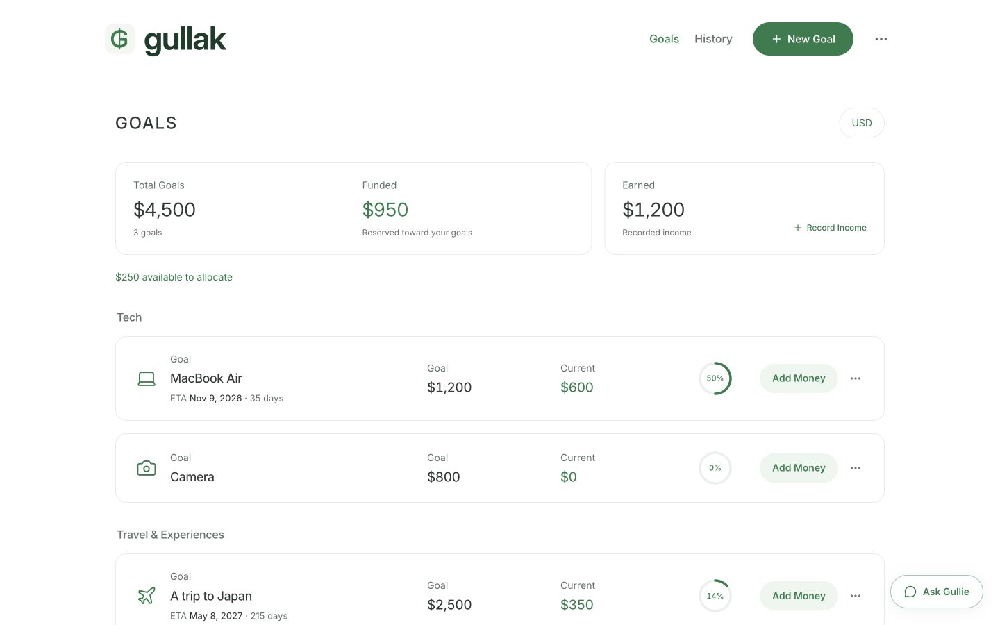
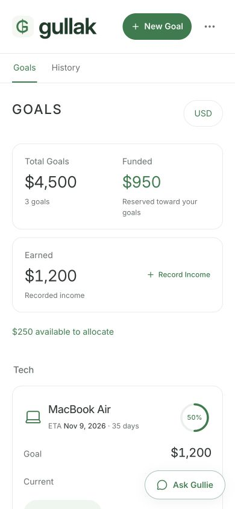
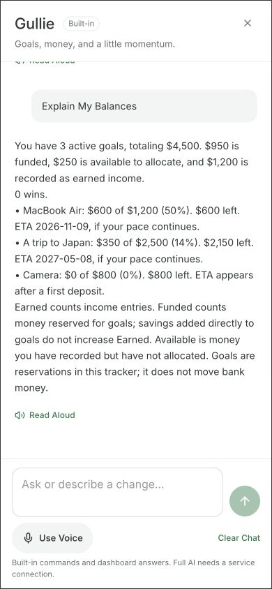

# Gullak

**Your savings. Your goals. A little closer.**

Gullak turns things you want to save for into clear goals, balances, and progress. Record income, put money aside, and see what is funded and what is still available. Gullie helps explain your dashboard and prepare changes for your review.

### [Open the live app →](https://gullak-aditya.thegameraadi3.chatgpt.site/)

**Built by [Aditya](https://github.com/thegameraadi).** Works in a desktop browser, on your phone, and from a Safari Home Screen icon.



## What you can do

- **Set meaningful goals.** Name a goal, choose a target and optional date, then track funding and estimated progress. Import product details from supported shop links or enter them yourself.
- **Keep the numbers clear.** Record income, allocate available funds, add existing savings, split funding, and review purchases. History edits recalculate the ledger.
- **Use USD or INR.** View converted amounts with the reference rate and date; original entry amounts remain in the ledger.
- **Ask Gullie.** Get goal summaries and balance explanations, or describe a change. Review its effect before saving. Built-in commands work without an AI service; the optional AI adapter requires server configuration.
- **Choose how to save.** Sign in with ChatGPT for an account saved on the server, or try a device-local guest dashboard. Download and restore backups from Settings.
- **Make it yours.** Light, dark, and system themes; voice input and read-aloud controls when your browser supports them.

Gullak records your savings decisions. It does not connect to a bank or move money.

## On your phone

<p>
  
  
</p>

In Safari, open the live app, tap **Share → Add to Home Screen**, and keep that icon. New releases use the same app address and identity.

### Updates without reinstalling

Gullak fetches a fresh page when opened. While running, it checks the deployed release when you return to the app, reconnect, and every minute while visible. A changed release loads automatically after a quiet moment. Open dialogs, focused input fields, menus, and saves defer the reload so it does not discard a form or interrupt a change.

You do **not** need to delete the Home Screen icon, reinstall the app, or clear browser data. An already suspended session from before this update feature was released needs one normal close and reopen to load the new updater. Thereafter it checks future releases automatically while online. iOS controls when suspended apps run; updates cannot run while the app is closed or offline. Saved account data and guest storage are preserved by a normal reload. iOS may keep the installed icon artwork even when app content changes.

**Guest data stays in this browser.** Clearing website data can remove it; download a backup if you need another copy. Fresh launches require connectivity because Gullak does not cache an offline app shell.

## Run locally

Use Node.js **22.13 or later** and the package-manager version recorded in `package.json`.

```sh
pnpm install --frozen-lockfile
pnpm dev
```

Open `http://127.0.0.1:5173` and choose **Continue as a Guest**. The portable preview also provides a local sign-in simulation; production sign-in is provided by Sites.

```sh
pnpm test               # Product and update-behavior tests
pnpm exec tsc --noEmit   # Type check
pnpm build              # Cloudflare Worker + browser assets
pnpm test:worker        # Built Worker integration checks
```

The [development guide](docs/development.md) covers local storage bindings, migrations, preview profiles, and platform authentication.

## Deployment

### Private product analytics

The owner dashboard lives at `/manage`, with no entrance from the public app. Sign in with ChatGPT; the server binds access to the Site owner's verified account and rejects all other accounts. It reports visitors, sessions, returning browsers, referrals, device and Home Screen use, feature adoption, and Gullie activity across 7, 30, or 90 days. Collection begins with this release, so earlier traffic is not reconstructed.

Analytics stores coarse usage events, never balances, earnings amounts, goal names, conversation text, full referral URLs, or email addresses. Do Not Track and Global Privacy Control are respected. See [analytics and search setup](docs/analytics.md) and the app's [privacy details](https://gullak-aditya.thegameraadi3.chatgpt.site/privacy).

The public introduction includes search metadata, structured application data, and a sitemap. Private dashboards are excluded from indexing. Google Search Console provides search impressions, clicks, queries, and position once Google processes the site; those reports are separate from the product dashboard.

| Surface | Purpose |
| --- | --- |
| [Live Gullak](https://gullak-aditya.thegameraadi3.chatgpt.site/) | The production app, hosted on Sites with a Cloudflare Worker and D1 database. |
| This repository | Public product source, documentation, screenshots, and change history. |
| GitHub Actions | Checks the source, types, build, and built Worker on pushes and pull requests. |

GitHub Pages is not the deployment target: Gullak includes authenticated server routes and a database. A GitHub push runs verification; publishing to the live app remains a separate Sites release. See the [deployment guide](docs/deployment.md) for the release procedure and mobile update design.

## Project map

| Path | Responsibility |
| --- | --- |
| `app/dashboard.tsx` | Goals, balances, history, settings, and dialogs. |
| `app/domain.ts` | Ledger rules and validated changes. |
| `app/gullie.ts`, `app/gullie-panel.tsx` | Assistant interpretation, proposals, and conversation UI. |
| `app/api/` | Account, assistant, exchange-rate, product, and release endpoints. |
| `app/app-updates.tsx` | Safe checks for newly published app releases. |
| `db/`, `drizzle/` | Database schema and migrations. |
| `tests/` | Product, update, and built Worker verification. |

## Quality and contributions

The responsive layout was checked from 320-pixel phone widths through 1440-pixel laptop widths, including short keyboard-height simulations. See [QA.md](QA.md) for tested behaviors and the limits of desktop browser testing. Screenshots use fictional guest demo data.

Found a problem? [Open an issue](https://github.com/thegameraadi/gullak/issues) with the screen size, browser, and steps to reproduce. Please keep personal financial records and credentials out of screenshots and reports.

The bundled Inter font and third-party components retain their respective licenses. Public visibility does not itself grant a separate license to the original application code.
